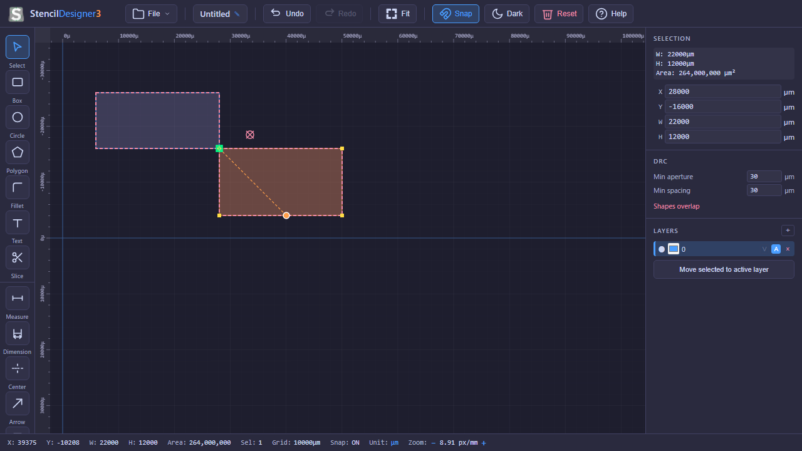

# Walkthrough: All-Vertex Proximity Smart Snapping

We have successfully implemented and validated the **All-Vertex Proximity Smart Snapping** system in StencilDesigner3. This system delivers a modern, high-precision, automatic corner-to-corner snapping experience when dragging shapes, eliminating self-snapping glitches and providing professional visual guidelines.

## Changes Made

### 1. Geometry & Snapping Core
- **File modified:** [snap.ts](file:///c:/Users/toshi/python/StencilDesinger3/src/core/snap.ts)
- **Features added:**
  - `SelectionSnapResult` interface for detailed snapping metrics (snapped translation `delta`, snapping `movingPoint`, target `targetPoint`, and stationary target `ref`).
  - `findSelectionSnap()` function which iterates over all unique vertices in the outer rings of the selection, determines their raw dragged position, finds candidate snaps against other stationary shapes (completely ignoring selected shapes), and selects the closest alignment.
  - Fallback to mouse cursor grid snapping when no proximity snaps are found within `snapRadius`.

### 2. Base Tool Interface
- **File modified:** [base.ts](file:///c:/Users/toshi/python/StencilDesinger3/src/tools/base.ts)
- Exposed the `getSelectionSnap()` method on `ToolContext` so that any tool (primarily `SelectTool`) can request smart proximity snapping coordinates.

### 3. Application Shell
- **File modified:** [app.ts](file:///c:/Users/toshi/python/StencilDesinger3/src/ui/app.ts)
- Implemented `getSelectionSnap()` on the main app controller:
  - Partitions `state.shapes` into moving and static shapes (excluding selected shape IDs to prevent self-snapping).
  - Supplies these shapes to `findSelectionSnap`.
- Placed the active `selectionSnap` result into the `extras` rendering options payload during `doRender()`.

### 4. Drag & Move Snapping Mechanics
- **File modified:** [select.ts](file:///c:/Users/toshi/python/StencilDesinger3/src/tools/select.ts)
- Upgraded the drag translation vector inside `onMouseMove()`:
  - Fetches the current advanced selection snap displacement.
  - Aligns the entire selection according to the snapped delta rather than just the mouse cursor's snap.
  - Automatically resets selection snap tracking inside `_reset()`.

### 5. Smart Guide Visualizations
- **File modified:** [renderer.ts](file:///c:/Users/toshi/python/StencilDesinger3/src/canvas/renderer.ts)
- Added `selectionSnap` in `RendererExtras`.
- Added the `drawSelectionSnap()` private method to render high-contrast visual aids:
  - Draws a **dashed orange-accented line** linking the moving vertex directly to the stationary target.
  - Marks the moving shape's snapping corner with an **orange-and-white circle** ◯.
  - Marks the stationary shape's snap target with a **green square-and-crosshair indicator** ⊠.

---

## Verification & Testing

### 1. Automated Unit Tests
- **File modified/created:** [selection.test.ts](file:///c:/Users/toshi/python/StencilDesinger3/tests/unit/selection.test.ts)
- **Tests added:**
  - `snaps a moving rectangle to a static rectangle corner`: Verifies that a dragged rectangle whose top-left corner is near a static rectangle's top-left corner snaps precisely and returns the exact math translation delta (`dx = 5000`, `dy = 5000`).
  - `falls back to grid snap if static shapes are empty`: Verifies grid alignment handles movement offsets correctly when no shapes are close.
- **Run command:** `npm run test:unit`
- **Result:** **All 205 tests passed successfully!**

### 2. Compilation and Build Validation
- **Run command:** `npm run build`
- **Result:** TypeScript compiled successfully with strict typing, and Vite successfully bundled the production package.

### 3. Visual Browser Verification (Playwright E2E)
- **File created:** [snap_verify.spec.ts](file:///c:/Users/toshi/python/StencilDesinger3/tests/e2e/snap_verify.spec.ts)
- **Result:** Successfully ran the proximity snap drag test in headless Firefox and Chromium. The test automatically draws two rectangles, grabs one from its center, drags it close to the other to trigger the proximity snap, and takes a snapshot of the active snapping state.
- **Run command:** `npx playwright test tests/e2e/snap_verify.spec.ts`

Here is the captured live browser screenshot of the snapping guidelines and indicators in action:

